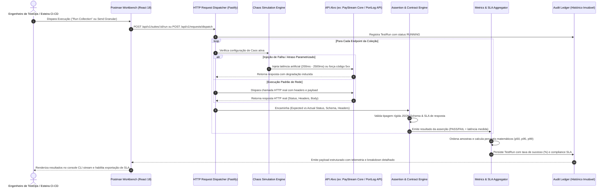

# Spectr TestOps ── Resilience & API Quality Engineering Platform

[](https://www.typescriptlang.org/)
[](https://nodejs.org/)
[](https://fastify.dev/)
[](https://react.dev/)
[](https://tailwindcss.com/)
[](https://www.framer.com/motion/)
[](LICENSE)

Plataforma corporativa para automação de testes de API, validação estrita de esquemas contratuais (JSON Schema / OpenAPI), injeção de caos em tempo de execução e governança de SLAs com medição de percentis de latência (p50, p95, p99).

Projetada para equipes de SRE, Engenharia de Software e QA Técnico, a arquitetura do Spectr TestOps desacopla suítes de teste de ambientes de execução, calcula métricas de cauda em alta precisão e audita a resiliência de microsserviços sob estresse induzido.

---

## 1. Arquitetura do Sistema & Fluxo de Execução

O ciclo de vida de execução abrange o disparo atômico ou em lote de requisições, injeção de vetores de instabilidade, avaliação determinística de asserções contratuais e consolidação no ledger imutável de telemetria.

### 1.1. Diagrama Sequencial de Execução



### 1.2. Isolamento de Workspaces & Parametrização de Ambientes
* **Isolamento por Workspace:** Toda a esteira opera em escopos restritos por identificador de organização (`workspaceId`), permitindo múltiplos clusters independentes sem colisão de coleções ou credenciais.
* **Resolução Dinâmica de Variáveis:** Suporte nativo ao padrão de substituição `{{BASE_URL}}` e tokens de autenticação encadeados (como tokens Bearer JWT gerados dinamicamente em passos de login e repassados a chamadas subsequentes).
* **Matriz de Ambientes Integrados:**
  * `production`: Aponta para o gateway de produção na nuvem (`https://paystream-gateway.onrender.com/api/v1`).
  * `staging`: Cluster intermediário de homologação (`https://staging-api.spectr-ops.internal/api/v1`).
  * `local`: Ambiente local de desenvolvimento com serviços rodando na porta `3334`.

---

## 2. Capacidades de Engenharia & Módulos Centrais

### 2.1. Assertion & Contract Engine
* **Conformidade Contratual OpenAPI/JSON Schema:** Validação estrutural profunda de payloads recebidos. Erros de omissão de campos obrigatórios, tipos incorretos ou formatos inválidos causam reprovação imediata da asserção contratual (`[SCHEMA_VALID]`).
* **Baterias de Validação Encadeadas:** Execução atômica por endpoint cobrindo:
  1. Status Code Match (ex: código retornado igual ao esperado pelo contrato RFC).
  2. Latency Threshold Match (ex: tempo total inferior ao teto configurado de 250ms/500ms).
  3. Header Security Checks (presença obrigatória de `Content-Type`, `X-Content-Type-Options`, `Cache-Control`).
  4. Body Shape Integrity (checagem de schemas com objetos aninhados e arrays).

### 2.2. Chaos & Fault Injection Lab
* **Injeção Programática de Latência:** Adiciona atraso artificial no ciclo de vida da requisição (configurável entre 50ms e 3000ms) para simular estrangulamentos de rede, degradação de tráfego interbancário e validação de timeouts em clientes consumidores.
* **Override Forçado de Status de Falha:** Força a emissão imediata de códigos HTTP de erro (`500 Internal Server Error`, `503 Service Unavailable`, `429 Too Many Requests`) para testar o acionamento de Circuit Breakers e estratégias de fallback.
* **Simulação Estocástica de Conexão Instável (Flaky Tests):** Introduz descarte probabilístico de pacotes com taxa de 50% para validação de esteiras com retry exponencial e jitter.
* **Análise Preditiva de SLA:** Cada teste de caos simula em tempo real o impacto projetado nos percentis `p95` e `p99`, emitindo classificação de risco (`LOW`, `MODERATE`, `HIGH`, `CRITICAL`).

### 2.3. Performance & SLA Benchmarking
* **Cálculo Rigoroso de Percentis:** As métricas de cauda são computadas matematicamente a partir da série temporal de latências individuais:
  `p95 = sortedLatencies[Math.floor(N * 0.95)]`
  `p99 = sortedLatencies[Math.floor(N * 0.99)]`
* **Detecção de Violação de SLA:** Comparação automática do `p95` medido contra o limiar contratual da suíte, sinalizando status `CONFORMING` ou `VIOLATION`.
* **Throughput & Taxa de Sucesso:** Correlação precisa entre o tempo total de execução da bateria e a proporção de asserções aprovadas vs total executado.

### 2.4. Postman-Inspired Workbench UI
* **Two-Pane Engineering Workstation:** Layout ergonômico dividido entre árvore lateral de coleções/endpoints com badges coloridos de métodos (`GET`, `POST`, `PUT`, `DELETE`, `PATCH`) e painel de inspeção técnica.
* **Single Request Execution & Syntax Highlighting:** Disparo isolado com tecla `Enter` ou botão `Send`, renderizando a resposta no padrão Postman com coloração de tokens sintáticos (chaves, strings, números e booleanos) e botão de 1-clique para cópia.
* **Zero Layout Shift (CLS) & Dropdown Corporativo de Idiomas:**
  * Seletor de idiomas flutuante com suporte nativo a Português (`PT-BR`) e Inglês (`EN-US`), com larguras mínimas protegidas para evitar saltos visuais.
  * Tema Claro/Escuro oficial Postman com paleta `#1C1C1C` / `#212121` e acento `#FF6C37`.
  * Atalho global `Ctrl+K` para foco imediato no filtro central de rotas.
* **Orquestração Framer Motion:** Transições suaves de abas via física de molas amortecidas (`damping: 28, stiffness: 350`) e renderização em cascata de linhas de console com delay de `0.04s`.

### 2.5. Audit Ledger & Relatórios de Conformidade
* **Registro Histórico Imutável:** Tabela de telemetria histórica preservando identificador de Run (`Run ID`), suíte alvo, total de testes aprovados, percentis medidos e data/hora exata.
* **Exportação Multiformato de SLA:** Emissão de relatórios técnicos completos em arquivos `.json` e planilhas estruturadas `.csv` para auditoria externa de conformidade e relatórios regulatórios de infraestrutura.

---

## 3. Matriz de Rotas & Contratos da API

A camada de backend opera sob Fastify, expondo endpoints RESTful versionados sob o prefixo `/api/v1`.

| Método | Endpoint | Descrição Técnica | Parâmetros / Payload |
|---|---|---|---|
| `GET` | `/api/v1/suites` | Lista todas as coleções de teste cadastradas no workspace. | Query: `workspaceId` (opcional) |
| `POST` | `/api/v1/suites` | Registra uma nova coleção de testes de API. | Body: `{ name, description, baseUrl }` |
| `PATCH` | `/api/v1/suites/:id` | Atualiza a Base URL ou propriedades da coleção. | Body: `{ baseUrl?: string, name?: string }` |
| `POST` | `/api/v1/suites/:id/cases` | Adiciona um caso de teste (endpoint) à coleção. | Body: `{ name, method, path, expectedStatus, maxLatencyMs, body? }` |
| `POST` | `/api/v1/suites/:id/run` | Executa a bateria sequencial completa de testes da coleção. | Retorna: `{ runId: string, status: 'RUNNING' }` |
| `GET` | `/api/v1/runs` | Consulta o histórico de execuções do Audit Ledger. | Query: `limit=30` |
| `GET` | `/api/v1/runs/:id` | Obtém detalhes completos e lista de asserções de uma execução. | Retorna: `{ run: TestRun & { assertions: TestAssertion[] } }` |
| `GET` | `/api/v1/chaos/simulate-delay` | Rota de injeção de atraso artificial de rede. | Query: `delay=350` (milissegundos) |
| `GET` | `/api/v1/chaos/simulate-error` | Rota de injeção forçada de falha de infraestrutura. | Query: `code=503` (500, 503 ou 429) |
| `GET` | `/api/v1/chaos/simulate-flaky` | Rota com comportamento intermitente probabilístico. | Retorna aleatoriamente HTTP 200 ou HTTP 500 |
| `GET` | `/health` | Verificação de disponibilidade operacional do motor. | Retorna: `{ status: 'online', uptime: number }` |

---

## 4. Instalação & Execução Local

### 4.1. Pré-requisitos
* **Node.js**: Versão `20.x` ou superior instalada.
* **Gerenciador de Pacotes**: `npm` v10+ ou `pnpm` v9+.
* **Git**: Para versionamento e clonagem do repositório.

### 4.2. Estrutura de Variáveis de Ambiente

Crie os arquivos `.env` nas respectivas pastas conforme a documentação abaixo:

#### Backend (`server/.env`):
```ini
# Configuração do Servidor Fastify
NODE_ENV=development
PORT=3334
HOST=0.0.0.0

# Chaves de Sandbox e Auditoria (Genéricas)
API_KEY_SECRET=test_api_key_sandbox_2026
CORS_ORIGIN=http://localhost:5173

# Nível de Log do Fastify
LOG_LEVEL=info
```

#### Frontend (`client/.env`):
```ini
# URL Base do Motor de Testes
VITE_API_URL=http://localhost:3334/api/v1

# Timeout Padrão para Disparo de Requisições Granulares (ms)
VITE_DISPATCH_TIMEOUT_MS=10000
```

### 4.3. Instruções de Instalação e Execução

Clone o repositório e instale as dependências dos dois módulos:

```bash
# 1. Clonar o repositório
git clone https://github.com/pedrhenriqueol/spectr-testops.git
cd spectr-testops

# 2. Configurar e executar o Backend Fastify
cd server
npm install
npm run dev

# O motor de testes estará operando em http://localhost:3334
```

Em um terminal paralelo, inicie a interface de usuário:

```bash
# 3. Configurar e executar o Frontend Vite
cd ../client
npm install
npm run dev

# O console de TestOps estará disponível em http://localhost:5173
```

### 4.4. Validação do Build de Produção

Para validar a integridade de tipagem estrita com TypeScript e compilação do bundle de produção:

```bash
# Validação do Backend
cd server
npx tsc --noEmit

# Validação do Frontend
cd ../client
npx tsc --noEmit
npm run build
```

---

## 5. Coleções de Demonstração Pré-carregadas

O sistema disponibiliza de fábrica coleções preparadas para testes imediatos de integração:

1. **PayStream Gateway ── Core Banking & Resilience Suite:**
   * `POST /auth/login`: Autenticação e geração dinâmica de token JWT para encadeamento.
   * `GET /auth/me`: Inspeção de claims de segurança do Merchant autenticado.
   * `POST /transactions`: Processamento de pagamentos com chave de idempotência e validação de SLA.
   * `GET /transactions`: Consulta de extrato transacional com filtros temporais.
   * `GET /health`: Verificação de heartbeat de infraestrutura bancária.
2. **Chaos & Latency Fault Tolerance Benchmark:**
   * Baterias parametrizadas contra os endpoints de caos (`/simulate-delay`, `/simulate-error`, `/simulate-flaky`) para homologação de resiliência e medição de desvios no cálculo de percentis p95/p99.

---

## 6. Governança de Código & Boas Práticas

* **Zero Tolerância a Falhas de Tipagem:** Código em modo estrito (`strict: true`) sem utilização de `any` em contratos públicos.
* **Componentes Puros & Acessibilidade:** Conformidade WCAG 2.1 AA em contraste de texto, navegação por teclado nativa e suporte a leitores de tela.
* **Tratamento Centralizado de Erros:** Erros de payload tratados com esquemas informativos Zod, mapeados em respostas padronizadas RFC 7807.

---

## 7. Licença

Este projeto é distribuído sob os termos da licença **MIT**. Consulte o arquivo [LICENSE](LICENSE) para mais detalhes.
