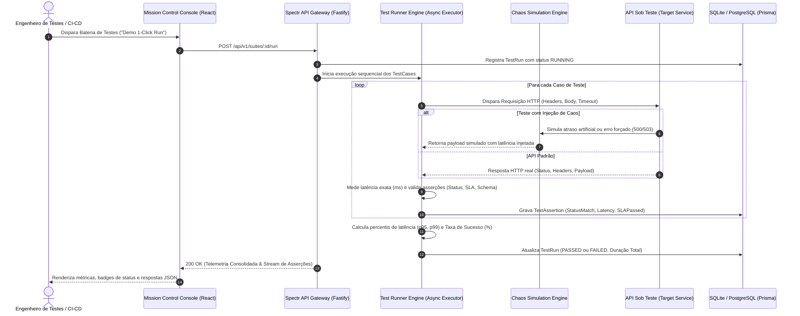

# Spectr TestOps ── Automated API Testing, Resilience & Chaos Engineering

[](https://www.typescriptlang.org/)
[](https://nodejs.org/)
[](https://fastify.dev/)
[](https://www.prisma.io/)
[](https://www.sqlite.org/)
[](https://react.dev/)
[](https://tailwindcss.com/)
[](LICENSE)

Plataforma corporativa de TestOps, Engenharia de Resiliência e Automação de APIs focada em execução de coleções HTTP, injeção de falhas controladas (Chaos Engineering), validação de contratos JSON Schema e auditoria contínua de SLAs de latência.

Projetado para times de SRE e Engenharia de Qualidade, o Spectr TestOps isola workspaces corporativos, orquestra baterias de testes com medição em milissegundos de percentis p95/p99 e simula degradações de infraestrutura (timeouts, indisponibilidade 503 e respostas flaky).

---

## 1. Arquitetura do Sistema & Pipeline de Testes

O pipeline executa baterias de requisições reais contra APIs de destino, inspeciona tempo de resposta e valida contratos em tempo real.



### 1.1. Isolamento Multi-Tenant & Organização de Testes
* **Workspaces Scoped:** Cada organização possui um `workspaceId` e chave de API dedicada.
* **Hierarquia Estruturada:**
  * `Workspace` ➔ `TestSuite` (coleção de testes com Base URL e Headers comuns) ➔ `TestCase` (especificação individual de método, caminho, payload, SLA máximo e schema).
  * Cada execução gera um `TestRun` com trilha atômica de `TestAssertion` para cada asserção executada.

---

## 2. Capacidades de Engenharia & Regras de Negócio

### ▪ Runner Determinístico de Alta Precisão
* Medição de tempo de resposta em milissegundos via temporizadores de alta precisão.
* Cálculo determinístico de percentis **p95** e **p99** ordenados, garantindo visibilidade clara sobre o comportamento de cauda das APIs.
* Encerramento antecipado por timeout configurável via `AbortController` para evitar travamento da esteira.

### ▪ Chaos & Resilience Playground
* **Atraso de Rede Artificiais:** Simulação de latências de 100ms a 3000ms (`/api/v1/chaos/simulate-delay`) para verificar o comportamento de circuit-breakers e timeouts do cliente.
* **Injeção de Falhas de Serviço:** Respostas imediatas com códigos HTTP 500, 503 ou 429 (`/api/v1/chaos/simulate-error`).
* **Intermitência / Flaky Testing:** Alternância estocástica de 50% entre sucesso e falha (`/api/v1/chaos/simulate-flaky`) para validar idempotência e retries.

### ▪ Validação de Contratos JSON Schema
* Verificação estrutural do payload retornado contra esquemas declarativos (`expectedSchema`), identificando propriedades ausentes ou tipos incompatíveis.

### ▪ Console Datadog-Inspired (Frontend)
* Desenvolvido em React 18, Vite e Tailwind CSS, adotando a paleta **Dark Obsidian** (`#090A0F`), containers em grafite profundo (`#121420`), acentos em **Violeta Elétrico** (`#8B5CF6`) e sinalização em **Verde Laser** (`#10B981`) para assertions aprovadas.

---

## 3. Matriz de Rotas & Contratos de API

Prefixo oficial: `/api/v1`

| Método | Endpoint | Descrição Técnica |
| :--- | :--- | :--- |
| `GET` | `/api/v1/suites` | Retorna todas as suítes cadastradas com seus casos de teste e última execução. |
| `POST` | `/api/v1/suites` | Cria uma nova suíte de testes com Base URL e headers globais. |
| `POST` | `/api/v1/suites/:id/cases` | Adiciona um caso de teste à suíte (método, path, body, status esperado e SLA ms). |
| `POST` | `/api/v1/suites/:id/run` | Executa a bateria de testes de uma suíte e calcula as métricas de latência p95/p99. |
| `GET` | `/api/v1/runs/:id` | Retorna a telemetria detalhada de uma execução com todas as asserções e payloads. |
| `GET` | `/api/v1/runs` | Lista o histórico recente de execuções com taxas de sucesso e duração. |
| `ALL` | `/api/v1/chaos/simulate-delay` | Injeta atraso artificial configurável via query (`?delay=1500`) ou body. |
| `ALL` | `/api/v1/chaos/simulate-error` | Retorna falha simulada (500, 503 ou 429) para testes de tolerância a falhas. |
| `ALL` | `/api/v1/chaos/simulate-flaky` | Simula endpoint instável com taxa de descarte de 50%. |
| `ALL` | `/api/v1/chaos/echo` | Endpoint utilitário que espelha os headers e o body enviados para validação de contrato. |
| `GET` | `/api/v1/metrics/overview` | Consolida KPIs globais: total de suítes, testes executados, taxa de sucesso % e p95 médio. |

---

## 4. Setup & Execução Local

### 4.1. Pré-requisitos
* Node.js 18.x ou 20.x LTS
* npm ou pnpm

### 4.2. Estrutura do Repositório
```
spectr-testops/
├── client/                 # Console Datadog-Inspired (React + Vite + Tailwind)
│   ├── public/             # Favicon SVG espectral
│   ├── src/
│   │   ├── api/            # Cliente Axios configurado
│   │   ├── components/     # Navbar, Dashboard, TestRunner, ChaosPlayground, Modais
│   │   └── types/          # Tipagem TypeScript de suítes, runs e asserções
│   └── package.json
├── server/                 # Engine de TestOps & Chaos (Fastify + Prisma + SQLite)
│   ├── prisma/             # Schema relacional SQLite e seed de demonstração
│   ├── src/
│   │   ├── engine/         # Runner de testes com medição p95/p99
│   │   ├── routes/         # Rotas de suítes, runs, chaos e métricas
│   │   └── server.ts       # Servidor Fastify
│   └── package.json
└── README.md
```

### 4.3. Configuração de Variáveis de Ambiente

Crie o arquivo `server/.env`:
```env
PORT=3335
DATABASE_URL="file:./dev.db"
CLIENT_URL="http://localhost:5173"
NODE_ENV="development"
```

Crie o arquivo `client/.env` (opcional em desenvolvimento):
```env
VITE_API_URL="http://localhost:3335/api/v1"
```

### 4.4. Inicialização Passo a Passo

1. **Instalar dependências:**
   ```bash
   # No diretório do servidor
   cd server
   npm install

   # No diretório do console
   cd ../client
   npm install
   ```

2. **Provisionar banco de dados local (Zero-Config SQLite):**
   ```bash
   cd server
   npx prisma generate
   npx prisma db push
   ```

3. **Popular com dados de demonstração (Seed):**
   ```bash
   npm run seed
   ```

4. **Inicializar os serviços:**
   ```bash
   # Terminal 1: Back-end TestOps Engine (Porta 3335)
   cd server
   npm run dev

   # Terminal 2: Front-end Console (Porta 5173)
   cd client
   npm run dev
   ```

5. **Acesso aos serviços:**
   * **Console TestOps:** `http://localhost:5173`
   * **Engine API & Chaos:** `http://localhost:3335`

---

## 5. Licença

Este projeto é distribuído sob os termos da licença [MIT](LICENSE).
